# Personal Banking Customer Support Agent

A sophisticated voice-powered customer support system built with Cartesia's agent framework. The system uses multiple specialized AI agents to handle different aspects of customer service through intelligent handoffs and routing. The system is configurable for any bank through the `config.py` file.

## System Architecture

The system follows a hub-and-spoke architecture with smart routing between specialized agents:

```mermaid
graph TD
    U[👤 User] --> W[👋 Welcome Agent]

    W --> |handoff_to_transaction| V{Verification Check}
    W --> |handoff_to_faq| F[❓ FAQ Agent]

    V --> |User verified| T[💰 Transaction Agent]
    V --> |User not verified| VER[🔐 Verification Agent]

    VER --> |handoff_to_transaction| T
    T --> |handoff_to_faq| F
    F --> |handoff_to_transaction| V

    style W fill:#1976d2,color:#ffffff
    style T fill:#2e7d32,color:#ffffff
    style F fill:#ff6f00,color:#ffffff
    style VER fill:#7b1fa2,color:#ffffff
    style V fill:#424242,color:#ffffff

```



### Flow Description

1. **Entry Point**: All conversations start with the **Welcome Agent**
2. **Agent Handoff Capabilities**:
   - **Welcome Agent** → `handoff_to_transaction` or `handoff_to_faq`
   - **Verification Agent** → `handoff_to_transaction` (only)
   - **Transaction Agent** → `handoff_to_faq` (only)
   - **FAQ Agent** → `handoff_to_transaction` (only)
3. **Smart Routing**: The chat harness intercepts `handoff_to_transaction` requests from Welcome and FAQ agents, routing unverified users to verification first. The Verification agent bypasses this check since users are always verified after successful verification.
4. **Terminal States**: The system converges on two specialized terminal agents that can hand off to each other:
   - **Transaction Agent**: Handles account access, balances, transfers, fraud reporting
   - **FAQ Agent**: Provides general information, rates, policies, and web search capabilities

## Example Conversation Flow


## Agents

### `chat.py` - Chat Harness
The central orchestrator that manages conversation flow between sub-agents. Key responsibilities:

- **Agent State Management**: Tracks current active agent and handles state transitions
- **Smart Verification Routing**: Automatically intercepts `handoff_to_transaction` requests from unverified users and routes them to verification
- **Handoff Processing**: Processes tool calls for agent transitions and streams initial messages from new agents
- **Context Forwarding**: Passes user messages and conversation history to the appropriate specialized agents

**Key Feature**: The harness modifies tool calls in-place, so if an agent requests `handoff_to_transaction` but the user isn't verified, it transparently changes the tool call to `handoff_to_verification`.

### Sub-Agents

#### `welcome_agent.py` - Welcome Agent 👋
**Role**: Entry point and initial request routing
- Greets customers with a friendly welcome message
- Analyzes initial user requests to determine appropriate routing
- Routes to Transaction Agent for banking needs or FAQ Agent for general questions
- Simplified logic - no longer handles verification checks (handled by chat harness)

#### `verification_agent.py` - Verification Agent 🔐
**Role**: Identity verification for secure banking access
- Collects customer identity information in sequence: name → date of birth → SSN last 4 digits
- Uses structured conversation pattern to ensure all required information is gathered
- Calls verification tools and handles success/failure scenarios
- Always hands off to Transaction Agent upon successful verification

#### `transaction_agent.py` - Transaction Agent 💰
**Role**: Secure banking operations and transactions
- **Capabilities**: Account balances, transaction history, money transfers, fraud reporting
- **Tools**: `report_fraud` for suspicious activity, `handoff_to_faq` for general information
- **Context-Aware**: Has access to customer's verified account information and transaction history
- **Security**: Only accessible to verified users (enforced by chat harness)

#### `faq_agent.py` - FAQ Agent ❓
**Role**: General information and web search capabilities
- **Capabilities**: bank policies, rates, branch information, general banking questions
- **Tools**: `run_faq_search` for real-time information, `handoff_to_transaction` for banking services
- **Search Integration**: Uses FAQ search agent for up-to-date information about rates, policies, and services
- **Public Access**: Available to all users without verification requirements

#### `sub_agent.py` - Base Agent Class
Abstract base class that defines the common interface for all specialized agents:
- **`initial_message()`**: Returns initial greeting/message when agent becomes active
- **`generate()`**: Main conversation handling method that processes user messages and yields responses
- **Testing Framework**: Includes conversation testing utilities and response validation helpers

## Running the System

### Start the Voice Agent
Run the main voice agent system:
```bash
uv run main.py
```

### Run Tests
Execute the test suite:
```bash
# Run tests for a specific agent (e.g., verification agent)
uv run pytest sub_agents/verification_agent_test.py

# Run all test files
uv run pytest
```
